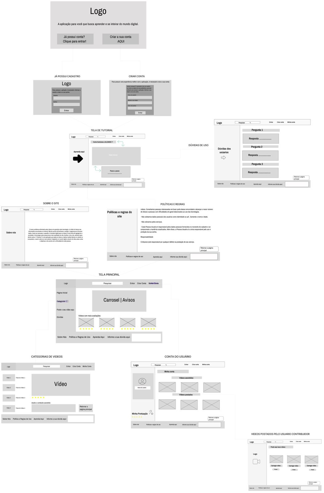

# Projeto de Interface

 As páginas foram criadas pensadas nas dificuldades expostas pelo público que fará uso da aplicação, sendo assim, possuindo interfaces simples e objetivas, com letras maiores e uma página para explicar a utilização da aplicação. Página Inicial (Página voltada para o usuário escolher se dejesa criar a sua conta ou entrar na aplicação), Página Login (Página que o usúario informará o login e senha para acessar a aplicação), Página Criar Conta (Página criada para o usuário realizar o seu cadastro na aplicação, sendo solicitado nome, idade e senha para a criação da conta), Página Principal (Página principal da aplicação, onde o usuário terá acesso a carrosel de avisos, barra de navegação, rodapé e os vídeos mais bem avaliados), Página dos Vídeos (Página que o usuário será direcionado para assistir os vídeos escolhidos, sendo possível avaliar o conteúdo assistido) , Página Minha conta ( Interface simples, com algumas informações dos vídeos assistidos e sistema de pontução ), Sobre nós ( Página informando nosso objetivo e motivaçao), Dúvidas dos usuários( Página onde será exibido as respostas das principais dúvidas dos usuários ), Postar vídeos ( Página para quem deseja adicionar os vídeos), Políticas do site e Aprenda aqui ( Página incial explicando passo a passo do uso na aplicação).

## User Flow

## Wireframes

