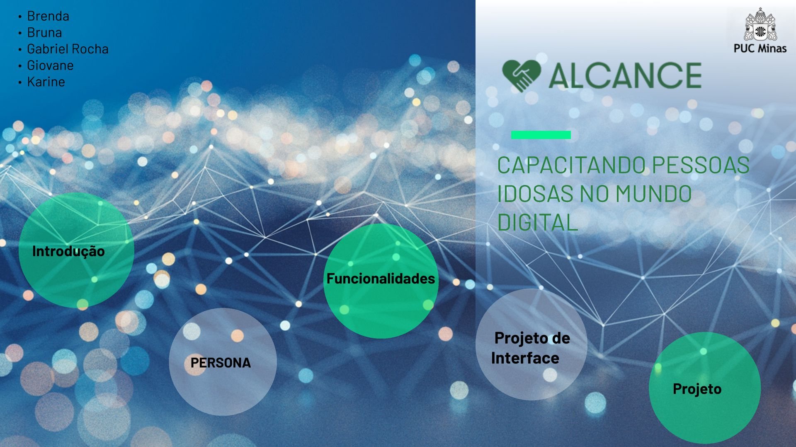
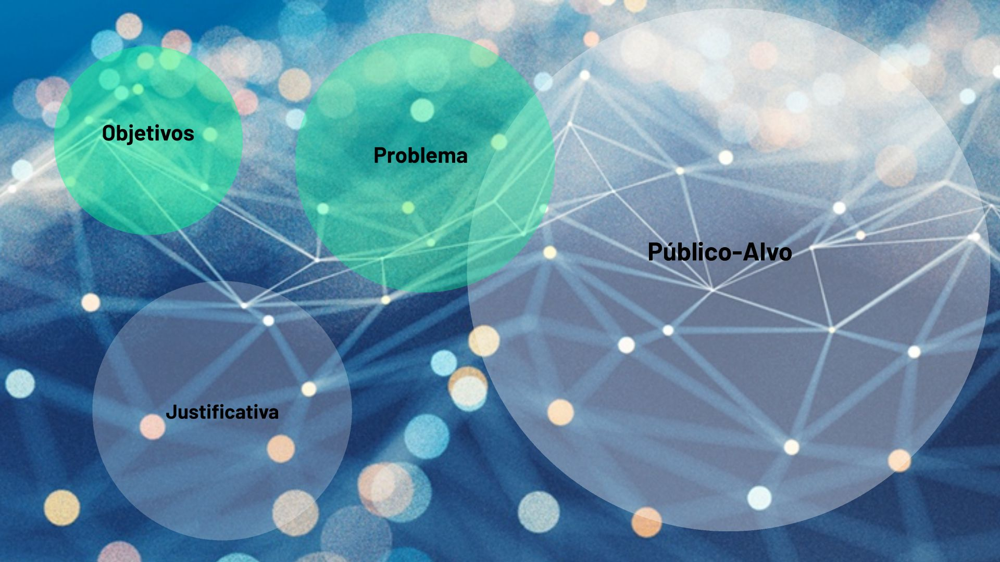
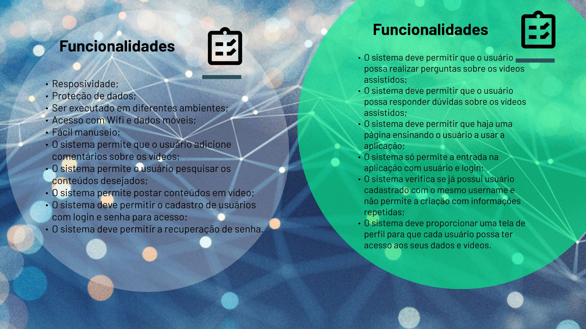
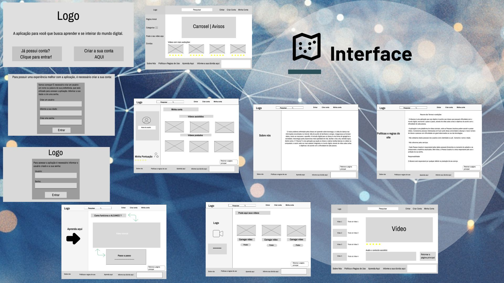
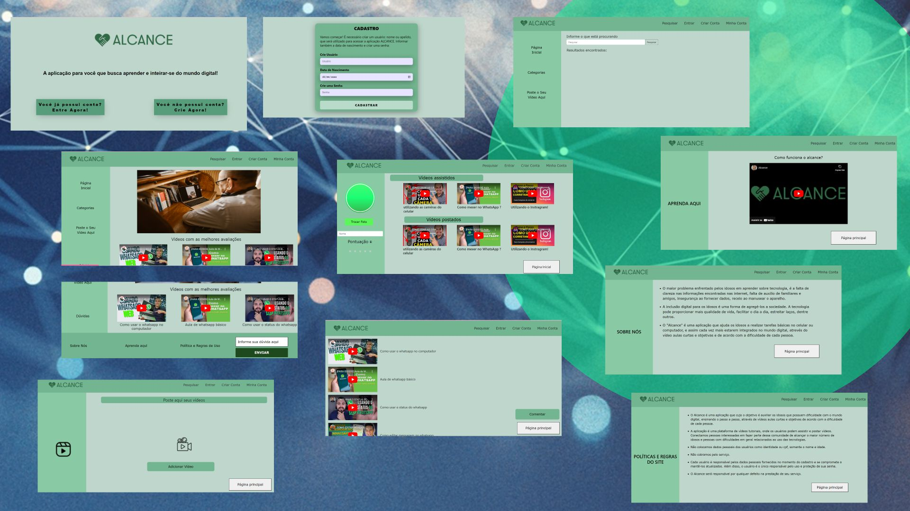

# Apresentação

Faça uma apresentação de um resumo de todos o processo de desenvolvimento e no final apresente a solução desenvolvida, usando um pequeno vídeo.

Liste os arquivos produzidos e postados nesta pasta, com suas localizaçãoes e descrição do conteúdo neste arquivo Readme.md.

* [Pitch inicial](./sample-pitch.pdf) -- arquivo com os slides da apresentação inicial
* [Apresentação final](./sample-presentation.pdf) -- arquivo com os slides da apresentação final
* [Vídeo de demonstração](./sample-video.mp4) -- arquivo com a demonstração do funcionamento do sistema

O conjunto de slides deve ser apresentado em um arquivo PowerPoint ou PDF. A apresentação do projeto deve contemplar todos os itens trabalhados nos demais artefatos. Alguns aspectos que devem ser contemplados na apresentação são listados a seguir.

## Título do Projeto

Alcance , capacitando pessoas idosas no mundo digital.

## Identidade Visual (Marca, Design)

## Conjunto de Slides (Estrutura)

## Vídeo de demonstração

[Vídeo](pdf/img/videoapresentacaoalcance.mp4)

