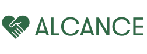
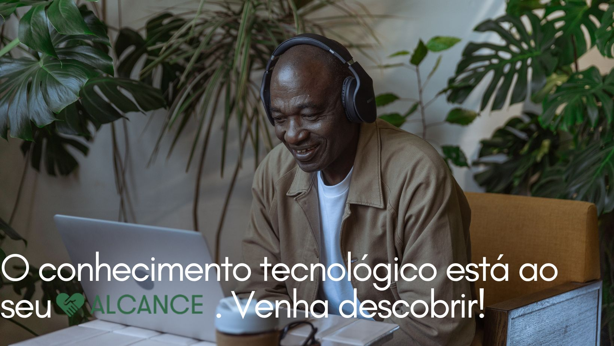
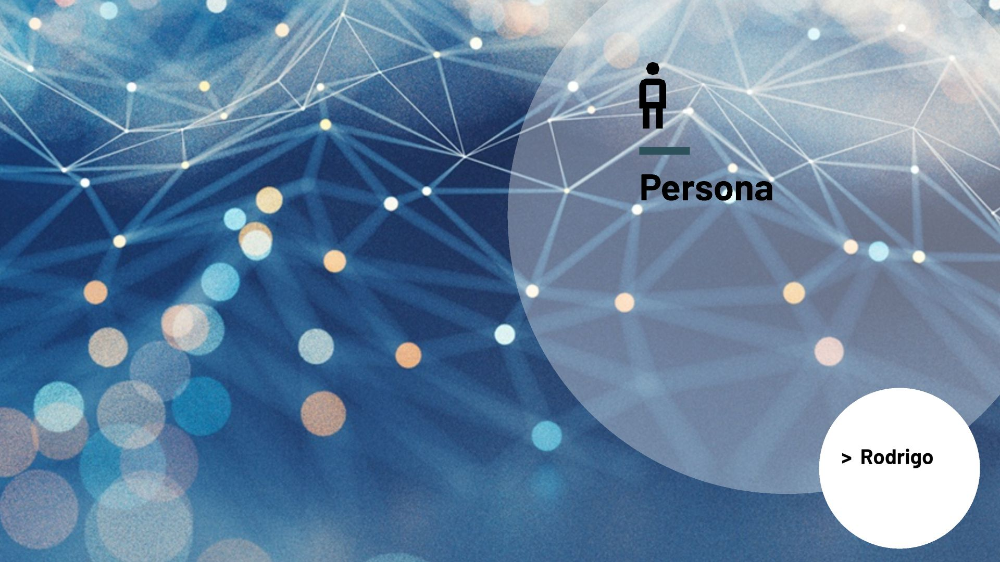

# Apresentação

O Alcance é uma aplicação que auxilia pessoas idosas que possuem dificuldade com o mundo digital, a integrá-los nesse meio. Por meio de vídeo aulas curtas com o passo de como executar cada tarefa até se alcançar o objetivo, como por exemplo: Fazer chamadas, interagir em redes sociais, pesquisas e entre outras tarefas pertinentes no mundo digital.

* [Pitch inicial](pdf/Alcanceppt.pptx) -- arquivo com os slides da apresentação inicial
* [Apresentação final](pdf/img/Prezi%20WIN%20Alcance.exe) -- arquivo com os slides da apresentação final
* [Vídeo de demonstração](pdf/img/videoapresentacaoalcance.mp4) -- arquivo com a demonstração do funcionamento do sistema

## Título do Projeto

Alcance , capacitando pessoas idosas no mundo digital.

## Identidade Visual (Marca, Design)

## Conjunto de Slides (Estrutura)

## Vídeo de demonstração

[Vídeo](pdf/img/videoapresentacaoalcance.mp4)

